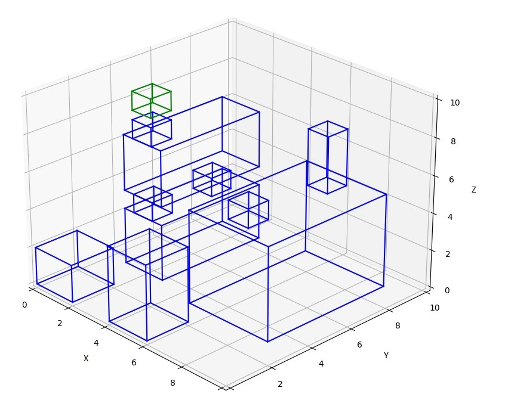
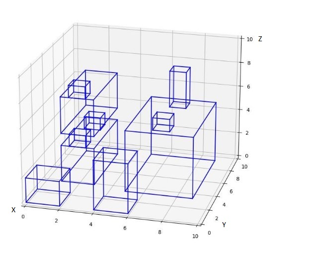

**Trabajo FinalSO3D-AR** 
: 

**Sebastian Fuchilieri y**

**Daniel Silva**

29 de Julio de 2022 Facultad de ingeniería

1. **Introducción**

En el presente informe se hará un análisis del algoritmo realizado para el trabajo final de la cátedra Inteligencia Artificial I, este algoritmo trata de resolver la problemática de la colocación de un objeto en un espacio 3D con obstáculos, es decir, contesta la pregunta de cuál es la mejor posición para colocarlo dada una serie de parámetros.

El algoritmo fue hecho con un algoritmo genético, que usa un cruzamiento multipunto

2. **Marco teórico**

Antes de empezar a explicar los resultados, es necesario explicar cómo llegamos a plantear la solución que le dimos al problema, también la investigación previa que hicimos.

Comenzamos investigando un poco el problema de la colocación de objetos en espacios 3D, nos dimos cuenta que nuestro planteamiento inicial de resolver el problema mediante un algoritmo genético era correcto, puesto que, la mayoría de las implementaciones de internet eran soluciones a través de este tipo de algoritmos y CSP, y además, como es un problema de optimización va muy bien con la esencia de los algoritmos genéticos.

De todas las investigaciones que hicimos, hubo un paper que más destaco [1], este paper ordena objetos en un espacio vacío en base a las descripciones en lenguaje natural que se les daba, por ejemplo, “un espacio con 5 sillas, una mesa y un mueble” y el

programa ordenaba el espacio de tal forma de cumplir las instrucciones en lenguaje natural.

A través de este paper se nos dieron indicios muy claro de cómo deberíamos tratar a los objetos en el espacio 3D respecto a sus características, colocaciones e interacciones, analizamos como hacía uso de CSP para las validaciones de los objetos correctos y también vimos con detenimiento la técnica de cruzamiento que empleaba.

1. Cruzamiento y mutaciones

Esto nos llevó a analizar las posibles técnicas de cruzamiento de los algoritmos genéticos para elegir la adecuada entre los 4 principales algoritmos de cruzamiento encontrados: Single-Point Crossover, Multi-Point Crossover, Linear Crossover, Blend crossover, Simulated binary crossover

Gracias al apoyo del paper antes mencionado, se decidió elegir Multi-Point Crossover con mutación aleatoria.

En este cruzamiento, se determinan de forma aleatoria o especificada, los puntos de corte en el cromosoma, obteniendo porciones de genes, los cuales serían intercambiados entre los padres para así poder generar a los respectivos hijos del cruzamiento. Sumado a esto, con una probabilidad aleatoria, se determina una posible mutación, en la cual se aplica una variación sobre un gen aleatorio. De esta forma, se obtiene una población que va tendiendo al resultado óptimo, pero se evita quedar atrapado en un óptimo local.

El uso de esta técnica de cruzamiento se debe a la estructura de cromosomas y genes que se aplicó para resolver el problema, siendo esta la forma más práctica que se encontró para llevar a cabo el proceso genético, puesto que, a través de este cruzamiento, pudimos cambiar las posiciones X, Y Z en cada iteración de forma múltiple(cambiando al menos 2 de las posiciones)

Las demás técnicas de cruzamiento fueron descartadas ya que no resultaban tan interesantes o no se les vio una buena aplicación para nuestro problema.

A la hora de tomar la decisión, los dos candidatos finales fueron Blend Crossover y Multi-Point Crossover.

Blend Crossover, mediante una fórmula matemática, determina un rango entre los

padres, de los cuales de forma aleatoria, se obtienen a los hijos. Este método nos resultó bastante interesante y con una característica particular, de a poco va atendiendo a los casos con mejor fitness. Pero terminó siendo descartado, ya que con una investigación posterior, se encontró que puede ser más fácil que dicha tendencia termine cayendo en un óptimo local.

Por otro lado, Multi-Point Crossover cumple con todas las necesidades que nos planteamos a la hora de cruzar padres y generar los hijos, ya que al realizar múltiples cortes y hacer los cruzamientos, esto se puede interpretar como un objeto que cambia su posición en un espacio 3d, variando su posición relativa en el espacio, todo esto considerando que los genes representan diferentes características del objeto a colocar en el espacio.

##### Detalle sobre la poblacion inicial

La poblacion inicial se genera aleatoriamente en base a una funcion. Los individuos generados parten de una base, deben asemejarse a las caracteristicas "fisicas" del objeto que se quiere colocar inicialmente en el espacio, ¿que significa esto?.

Como se explico, los individuos estan compuestos por variables que determinan su posicion en el espacio (X,Y,Z) y variables que determinan sus caracterisitcas (alto, ancho, largo). Estas ultimas son copiadas por los individuos generados aleatoriamente, lo unico que se "randomiza" son sus variables con relacion a la poscion con los ejes coordenados, la cual puede varias del 0 al 9, aumentando de a 0,5.

Una vez se genera un individio, se procede a validar al mismo. Se debe checkear que no este dentro de otro objeto en el espacio y que, ademas, tenga una base en la cual apoyarse por completo, no se aceptan objetos con partes suspendidas en el aire.

En el siguiente ejemplo, los objetos azules son los correspondientes al entorno, colocados previamente. El cubo verde sera la demostracion del objeto generado aleatoria mente, el cual ira variando para cada ejemplo correspondiente.

###### Casos de ejemplos aleatorios

Este ejemplo, el individuo generado para la poblacion inical, pasaria la primera validacion, ya que no se encuentra dentro ni colicionado con ningun objeto del espacio, pero seria descartado posteriormente ya que no se encuentra sobre ninguna base.

En este caso, el objeto no pasaria ninguna de las validaciones ya que se encuentra colisionando con un objeto del entorno y a su vez no cuenta con una base solida.

En este ultimo caso, el objeto pasaria todas las validaciones ys eria tomado como un elemento de la poblacion incial.

Con los ejemplos anteriores, se intenta aclarar el proceso por el cual el algoritmo pasa en una primera instancia, el mismo debe lograr generar el numero de casos iniciales validos solicitados, para posteriormente pasar a realizar los cruzamientos propios del algoritmo genetico, haciendo que los individuos generados se crucen, intercambiando los valores de sus variables relacionadas a la posicion en el espacio.

##### Detalle sobre el cruzamiento

La estructura genetica que se propuso para los individuos en este trabajo gue la siguiente:

 - Posicion del objeto en el eje X
 - Posicion del objeto en el eje Y
 - Posicion del objeto en el eje Z
 - Alto del objeto
 - Ancho del objeto
 - Largo del objeto
 - Punto dado al cual se quiere aproximar

Analizaremos las caracterisitecas mas basicas pero, a su vez, mas relevantes para el problema, las posiciones en el plano coordenado X Y Z.

Como se menciono un poco mas arriba, se utilizo Multi-Point Crossover, en el mismo, el corte se realiza de manera aleatoria, en cada cruzamiento se varia que cromosomas del gen seran cruzados, de esta forma se aumenta aun mas la aleatoriedad a al hora de cruzar, esto descicion se tomo teniendo en cuenta que en cada iteracion, se reutiliza a los mejores de la poblacion. Con esta pequeña pero efectiva modificacion, se evito caer en gran medida en maximos locales o que los cruzamientos se vean repetidos y se produzca un estancamiento.

Para hacer una demostracion del cruzamiento y que la misma no sea engorrosa de entender, se procede a utilizar un entorno totalmente vacio, ya que la finalidad del mismo es mostrar claramente el comportamiento de un cruzamiento, por lo que en esta demostracion no se aplicaran vaklidaciones sobre los individuos.

Para realizarlo, se necesitan 2 individuos previamente generados:

###### Entorno con los individuos colocados antes del cruzamiento

###### Entorno con los individuos y los nuevos individuos resultantes del cruzamiento

Con estra sencilla demostracion, se puede ver claramente los dos individuos (cubos azules) previos al cruzamiento y luego, los mismos individuos y los hijos resultantes del cruzamiento (cubos verdes).

Esta seria una representacion a nivel de codigo del resultado que se mostro grafiacamente en las imagenes anteriores 

Con este ejemplo, se puede ver claramente como el cruzamiento, en este caso, se dio entre entre el par coordenado (X,Z), esto quiere decir, que cada hijo conservo la posicion en el eje Y del padre principal del cual se copio, pero sus coordenadas X Z fueron una combinacion aleatoria de la de sus progenitores. Como el cruzamiento se da de forma aleatoria, el par ordenado podria haber sido cualquier otra de las posibles combinaciones. Luego de eso, los individuos resultantes pasarian a una instancia de posible mutacion y luego se les harian las validaciones pertinentes para determinar si son o no aptos.

Una vez resuelta la técnica de cruzamiento a utilizar nos quedaba determinar las validaciones de que objetos colocados en el espacio considerábamos correctos, cómo calculamos su fitness y al final poner todo en funcionamiento en el algoritmo genético.

2. Validaciones en el espacio

Dentro de lo que es validaciones en el espacio, definimos las siguientes reglas:

- El objeto debe estar sobre una superficie.
- La superficie debe ser mayor o igual a las dimensiones de la base del objeto.
- Que el alto quepa en el área.
- Que el ancho quepa en el área.
- El objeto no se debe superponer(traspasar) con otro objeto.

Estas reglas se tuvieron que programar como validaciones que tenían que pasar los objetos que se iban generando en cada generación, como se tenia un entorno estático en cada experimento, entorno que poseía distintos objetos que ocupaban el espacio 3D(posiciones en una matriz 3D), se tuvo que validar principalmente que los 4 vértices de los objetos a colocar estuvieran sobre un espacio ocupado y también que las dimensiones del objeto a colocar no tocara ningún otro espacio ocupado.

Con estas 2 validaciones se cumplían las 5 reglas planteadas al principio de esta sección, a continuación, vemos en la figura 1 como es un ejemplo del entorno estático construido.

Figura 1. Entorno estático de pruebas.

3. Función Fitness

La función fitness es un pilar fundamental del funcionamiento de nuestro algoritmo, esta función diferencia a un genoma bueno de un genoma malo, es decir de una mejor solución que otra. El fitness de un objeto en este algoritmo es calculado bajo los siguientes criterios:

- Mientras más grande la superficie donde esté apoyado mejor
- Mientras más distancia tenga de otros objetos mejor
- Mientras más cercano esté al punto dado mejor
- Mientras más distancia haya frente a otro objeto desde arriba mejor

Estos criterios implican que se debía calcular con un algoritmo cada una de las situaciones, para calcular la superficie de donde esta apoyado el objeto, lo que se hizo fue recorrer los puntos donde estaba apoyado el objeto desde el punto central de la base, esto se explica con mas detalle en la siguiente seccion.

Para las distancias de los objetos de frente y arriba lo que se hizo es cortar con un plano al objeto desde el centro(plano paralelo al XY para la distancia horizontal y plano paralelo al YZ para la vertical), dentro de este plano se buscaba el punto de colisión más próximo al objeto y se calculó la distancia desde ese punto hasta el centro.

En el cuarto criterio se especificó un punto en la inicialización del objeto, el objeto suma fitness en base a la distancia de este punto, eso es similar a una condición en la cual existe una persona que hace de observador, y el objeto debería estar lo más cercano al punto posible, siempre y cuando con comprometa una mejor posición del objeto, por eso todos estos criterios son ponderaciones.

###### Detalle de la implementacion de la funcion fitness

Para la construcción de la funcion fitness se tuvieron en cuenta las criterios anteriores y se ponderó de la siguiente manera:

En el caso de la metrica de fitness que le damos a un objeto mientras mas grande sea la superficie en la cual esta apoyado, hicimos un calculo que implico lo siguiente:
    - Desde el centro del objeto bajar n posiciones en el eje Z hasta encontrar una superficie
    - Con la superficie encontrada en Z = N, procedemos a iterar en los 4 ejes paralelos al plano XY, es decir, disparamos un bucle que aumente en 1 la X de la posicion encontrada, que reste en 1 a la X de la posicion encontrada, que sume 1 a la Y de la posicion y que reste 1 a la Y de la posicion.
    - El recorrido en los 4 ejes, se detiene cuando encuentra un lugar en el espacio que no esta lleno, es decir cuando llega al borde del objeto, despues devuelve los valores de la cantidad de posiciones que fueron recorridos en los 4 ejes paralelos al plano XY. Luego, estos valores son usados para calcular el fitness

La formula del fitness de la superficie es:
fitnessDeLaSuperficie = (recorridoEnSuperiorX + recorridoEnSuperiorY + recorridoEnXInferior + recorridoEnYInferior) * 100/40
Se observa que en la formula se le agrega una multiplicacion 100 y una division por 40, esto es para ponderar el fitness con un numero del 1 al 100, por eso a traves de la formula de porcentaje se calcula de esta forma. El numero 40 es el resultado maximo que puede tener una superficie de base, esta metrica esta tomada desde el centro hacia los 4 lados, en un espacio con 20 puntos de ancho y de profundidad, desde el centro se tienen 10 puntos hacia los 4 lados.

En el segundo caso, para la metrica del fitness de mientras mas distancia tenga de otros objetos mejor procedimos de la siguiente manera:
    - Desde el centro del objeto, cortamos ese punto con un plano paralelo al XY y se empieza a recorrer este plano buscando los puntos que se encuentran ocupados
    - Cada vez que se encuentra un punto ocupado, se calcula distancia de ese punto con la formula de la distancia en el plano
    - Vamos iterando a traves de los puntos y nos quedamos con la distancia menor.

Esta distancia menor es la metrica que se utiliza para la calcular el fitness
La formula es la siguiente:

fitnessDistancia = distanciaMenor *100/20
Se observa que en la formula se le agrega una multiplicacion 100 y una division por 20, esto es para ponderar el fitness con un numero del 1 al 100, por eso a traves de la formula de porcentaje se calcula de esta forma. El numero 20 es el resultado maximo que puede tener la distancia entre 2 puntos en el plano, esto se calcula en base al ancho del espacio.

En el tercer caso, para la metrica de la cercania al punto dado, mientras menor sea la distancia al punto dado es mejor la metrica de fitness, esto se calcula a traves de la formula de la distancia desde el centro del objeto hasta el punto dado, esto es distancia en el espacio y no en el plano.

Una vez obtenida esta métrica de distancia se procede a calcular la formula

fitnessPuntoDado = distanciaPuntoDado * 100/40
Se observa que en la formula se le agrega una multiplicacion 100 y una division por 40, esto es para ponderar el fitness con un numero del 1 al 100, por eso a traves de la formula de porcentaje se calcula de esta forma. El numero 40 es el resultado maximo que puede tener la distancia entre 2 puntos en el espacio, esta situacion seria en el caso de que los puntos estuvieran en los extremos opuestos del espacio.

En el cuarto caso, para la metrica de fitness de la distancia desde arriba se calculo de la siguiente forma:
    - Desde el centro del objeto, cortamos ese punto con un plano paralelo al YZ y se empieza a recorrer este plano buscando los puntos que se encuentran ocupados
    - Cada vez que se encuentra un punto ocupado, se calcula distancia de ese punto con la formula de la distancia en el plano
    - Vamos iterando a traves de los puntos y nos quedamos con la distancia menor hacia arriba.

Esta distancia menor hacia arriba es la metrica que se utiliza para la calcular el fitness
La formula es la siguiente:

fitnessDistancia = distanciaMenorHaciaArriba *100/20
Se observa que en la formula se le agrega una multiplicacion 100 y una division por 20, esto es para ponderar el fitness con un numero del 1 al 100, por eso a traves de la formula de porcentaje se calcula de esta forma. El numero 20 es el resultado maximo que puede tener la distancia entre 2 puntos en el plano, esto se calcula en base a la altura del espacio.

Finalmente, una vez obtenidas las 4 metricas de fitness se suma todo el fitness en una sola variable, excepto por la distancia del punto dado ya que es necesario que esta metrica se reste en vez de sumar, porque el fitness deberia aumentar mientras menos distancia haya hacia el punto dado.

4. Entorno y Visualización.

Como se vio en la Figura 1, tenemos un entorno gráfico en el cual mostramos los resultados, este entorno gráfico lo mostramos usando la librería de python Matplotlib, a través de esta librería podemos dibujar vectores en el espacio, a cada objeto, calculamos sus respectivos vectores que son sus aristas y luegos los graficamos.

Al momento de ejecutar el algoritmo, todos estos objetos se dibujan en un espacio 3D de forma sólida, es decir, que en base a sus dimensiones se van marcando las posiciones de la matriz 3D con una marca de ocupado.

5. Diseño del algoritmo genético.

Una vez construido todo el marco teórico del proyecto, así como también las capacidades de calcular fitness, validar las posiciones, cruzamientos/mutaciones y la visualización de los resultados, solo quedó unir las piezas para hacer funcionar el algoritmo.

Lo que hacemos primero en el algoritmo es generar las poblaciones iniciales, estas poblaciones se referieren a objetos con las mismas dimensiones que el objeto a colocar pero con diferentes posiciones X Y Z, estos objetos pasan por una etapa de validación donde se verifica que estén dentro del espacio, que estén en apoyados sobre algo y que no colisionan con otros objetos.

Con esta población inicial se empieza a iterar el algoritmo, se seleccionan 2 individuos de la población y se los cruza, estos cruzamientos se validan y se calcula su respectivos fitness, luego se guardan los hijos nuevos y a los padres también.

Después de cruzar, se procede a ordenar la población por el fitness que tienen los individuos de mayor a menor y se descarta una porción de los peores, al final de la iteración guardamos lo mejor de toda esa población y volvemos a iterar.

A medida que pasan las iteraciones el algoritmo va convergiendo a solución, como vamos a ver las siguientes secciones.

3. **Diseño Experimental**
1. Qué métricas vamos a esperar

Respecto al diseño experimental, establecimos métricas de evaluación del algoritmo según el fitness, es decir, medimos el funcionamiento del algoritmo en base a que los fitness de la población inicial mejoren sustancialmente frente al individuo con mejor fitness, para esto presentaremos una serie de métricas de los fitness juntos a sus gráficos correspondientes.

La segunda métrica del funcionamiento del algoritmo es que tantas veces el objeto cae entre los mejores lugares en un entorno estático(el que vimos en la figura 1).

2. Resultado y análisis  de las métricas.

Como primera medición del comportamiento del algoritmo, se tomó de base el fitness de los casos utilizados como “población inicial”, teniendo en cuenta las condiciones antes mencionadas.

Figura 2. Evaluación del fitness de la población inicial.

En la figura 2 podemos ver el fitness de la generación de 50 individuos, totalmente aleatorios. Esta aleatoriedad se ve reflejada en el fitness de los casos, el mismo se comporta de manera muy errática ya que la única condición que se les pide a estos casos es que sean válidos.

Se considera válido a un objeto cuando:

- El objeto tiene una base en la que ser colocado mínimamente del mismo tamaño que su cara inferior
- El objeto no se encuentra total o parcialmente dentro de otro objeto del entorno generado

Partiendo de esta generación aleatoria, se procede a aplicar el algoritmo genético. Este mismo, en cada una de sus iteraciones, devolverá una nueva generación de individuos, los cuales son analizados para determinar su validez.

Los siguientes gráficos, figura 3, 4, 5 y 6, representan cortes en la 1°, 5°, 10° y 15° generación.

- 1°

Figura 3. Datos de fitness de la después de la primera generación.

- 5°

Figura 4. Datos de fitness de la después de la quinta generación.

- 10°

Figura 5. Datos de fitness de la después de la décima generación.

- 15°

Figura 6. Datos de fitness de la después de la quinceava generación.

Analizando los gráficos, se puede ver una clara “*evolución*” por parte de los individuos de la población a medida que van pasando las generaciones. Se ve una clara tendencia a un valor que, en este caso, es un máximo local.

Con esto, podemos comprobar la sustancial mejora en el fitness de los individuos luego de utilizar el algoritmo genético.

Con respecto a la métrica de cuantas veces el algoritmo coloca al objeto en alguna de las mejores posiciones del entorno, se determinaron 4 casos, los cuales se ejecutaron 100 cada uno y se obtuvo un valor promedio. Estos son los resultados:

|**Cantidad de generaciones**|**Tamaño de la población inicial**|**Valor promedio del mejor resultado**|**Precisión con respecto al mejor resultado**|
| - | - | - | - |
|1|5|61,690723|92,01116083|
|2|10|64,54670328|96,27082983|
|4|20|66,60962424|99,34765797|
|8|40|67,047|100|

Tabla 1. Resultados de la colocación en las mejores posiciones.

En la tabla 1 se puede observar que con una pequeña cantidad de iteraciones y muy pocos valores iniciales, el algoritmo es capaz de obtener más del 90% de precisión en sus resultados a la hora de colocar los objetos.

Para tener una comparativa de estos resultados, la siguiente tabla representa el valor promedio de un grupo de individuos generados de forma aleatoria, que cumplen con las condiciones necesarias para formar parte de la poblacion inicial.

|**Cantidad de individuos**|**Valor promedio del fitness de los individuos**|**Precisión con respecto al mejor resultado**|
| - | - | - |
|100|43,8268|65,36728265|

Con esto se puede ver, que las condiciones iniciales son tan fuertes y excluyentes que, incluso utilizando una generacion aleatoria de individuos, la presicion promedio es superior al 65% con respecto al mejor caso

4. **Conclusión**

Después de todo este análisis y comparación de diferentes casos de prueba y resultados similares, se tuvo que analizar el comportamiento del algoritmo, ya que los resultados son altamente precisos si se tiene en cuenta las pésimas condiciones iniciales con las que se ejecuta, ya que en casi todas las pruebas, el algoritmo obtiene más de un 90% de efectividad, sean cuales sean las condiciones iniciales.

Comparando el algoritmo y su comportamiento con otros algoritmos de su tipo, sumado a los aprendido durante el dictado de la cátedra se llegó a la siguiente conclusión:

La lógica que se tuvo que implementar para llegar a cabo el comportamiento deseado del algoritmo, si bien posee toda la estructura y características de un algoritmo genético, termina asemejándose y comportándose como un Constraint satisfaction problem.

El comportamiento del algoritmo y su lógica, es tan específica y los casos que se aceptan como válidos son tan acotados que *“a priori”,* cualquier caso generado aleatoriamente y validado,tiene una precisión promedio del 65% con respecto al resultado óptimo.

Teniendo esto en cuenta, pasa a tener sentido la velocidad con la que el algoritmo tiende a un máximo local o al propio máximo global.

5. **Fuentes**

[1] Stéphane Sanchez (2013). Constraint-Based 3D-Object Layout using a Genetic Algorithm. [Constraint-Based 3D-Object Layout using a Genetic Algorithm](https://www.researchgate.net/publication/245776169_Constraint-based_3d-object_layout_using_a_genetic_algorithm)
